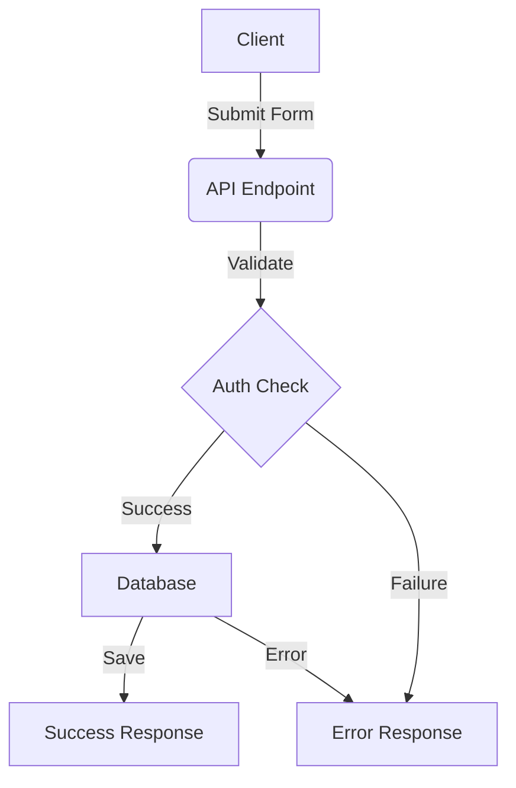

# API Routes Directory

This directory contains Next.js API routes that handle HTTP requests and responses.

## Directory Structure

```
/api
├── auth/                  # Authentication related endpoints
│   ├── [...nextauth]/    # NextAuth.js configuration and routes
│   └── cookie/           # Cookie-based auth handling
├── client-profile/       # Client profile management endpoints
│   └── route.ts         # Handles CRUD operations for client profiles
├── form/                # Form submission endpoints
│   └── route.ts        # Generic form handling
└── schema/             # Database schema related endpoints
    └── route.ts        # User schema operations
```

## Key Endpoints

### Authentication (`/auth`)

- Handles user authentication via NextAuth.js
- Manages session cookies and tokens
- Supports Google OAuth provider

### Client Profile (`/client-profile`)

- POST: Create new client profile
- PUT: Update existing profile
- GET: Retrieve profile information

### Form (`/form`)

- POST: Generic form submission handler
- Supports different form types
- Validates and stores form data

### Schema (`/schema`)

- GET: Retrieve user schema information
- Used for role-based access control

## Technical Architecture

### 1. Form Component (`substantial-use-form.tsx`)

- **State Management**

  - Uses React's useState and useEffect for local state
  - Implements form persistence with localStorage backup
  - Handles form validation and error states

- **Features**

  ```typescript
  interface FormFeatures {
    autosave: boolean;
    validation: boolean;
    errorHandling: boolean;
    dataBackup: boolean;
    roleBasedAccess: boolean;
  }
  ```

- **Form Sections**
  1. Research Information
  2. Applicant Details
  3. Laboratory Facilities
  4. Funding Resources
  5. Remarks & Additional Info

### 2. API Implementation (`route.ts`)

- **Endpoints**

  ```typescript
  interface ApiEndpoints {
    GET: "/api/substantial-use";
    POST: "/api/substantial-use";
    PUT: "/api/substantial-use";
  }
  ```

- **Authentication & Authorization**

  ```typescript
  interface AuthFlow {
    checkSession: () => Promise<Session>;
    validateRole: (roles: string[]) => boolean;
    handleUnauthorized: () => Response;
  }
  ```

- **Error Handling**
  ```typescript
  interface ErrorResponse {
    status: number;
    message: string;
    details?: any;
    stack?: string; // Development only
  }
  ```

### 3. Database Schema

```typescript
interface SubstantialUseSchema {
  substantial_use_id: UUID;
  user_id: UUID & ForeignKey;
  research_title: string;
  applicants: Array<{
    firstName: string;
    lastName: string;
    email: string;
    role: string;
    signatureDate?: Date;
    signature?: string;
  }>;
  laboratory_facilities: Record<
    string,
    {
      selected: boolean;
      details?: string;
    }
  >;
  funding_resources: Record<
    string,
    {
      amount: number;
      details: string;
    }
  >;
  remarks?: string;
  status: "draft" | "submitted" | "approved" | "rejected";
  created_at: DateTime;
  updated_at: DateTime;
}
```

## Role-Based Access Control

### Permission Levels

```typescript
enum UserRole {
  ADMIN = "admin",
  TTLO_STAFF = "ttlo_staff",
  CLIENT = "client",
}

interface Permissions {
  CREATE: UserRole[];
  READ: UserRole[];
  UPDATE: UserRole[];
  DELETE: UserRole[];
  APPROVE: UserRole[];
}
```

### Access Matrix

| Action         | Admin | TTLO Staff | Client |
| -------------- | ----- | ---------- | ------ |
| Create Form    | ✓     | ✓          | ✓      |
| View Own Form  | ✓     | ✓          | ✓      |
| View All Forms | ✓     | ✓          | ✗      |
| Edit Draft     | ✓     | ✓          | ✓      |
| Edit Submitted | ✓     | ✓          | ✗      |
| Delete Form    | ✓     | ✗          | ✗      |
| Approve/Reject | ✓     | ✓          | ✗      |

## Data Flow



## Error Handling & Logging

### Error Types

```typescript
type ErrorTypes =
  | "ValidationError"
  | "AuthenticationError"
  | "DatabaseError"
  | "NetworkError"
  | "UnknownError";
```

### Logging Levels

```typescript
enum LogLevel {
  INFO = "info",
  WARN = "warn",
  ERROR = "error",
  DEBUG = "debug",
}
```

## Security Measures

1. **Authentication**

   - NextAuth.js session management
   - JWT token validation
   - Session persistence

2. **Data Validation**

   - Input sanitization
   - Schema validation
   - Type checking

3. **Database Security**
   - Prepared statements
   - Transaction management
   - Cascade deletion rules

## Testing Strategy

1. **Unit Tests**

   - Form component validation
   - API endpoint handlers
   - Database queries

2. **Integration Tests**

   - Form submission flow
   - Authentication flow
   - Error handling

3. **E2E Tests**
   - Complete form submission
   - Role-based access
   - Data persistence

## Deployment & Maintenance

### Deployment Checklist

- [ ] Database migrations
- [ ] Environment variables
- [ ] API endpoint configuration
- [ ] Role permissions setup
- [ ] Logging configuration

### Monitoring

- Performance metrics
- Error tracking
- Usage statistics
- Security audits

## Future Roadmap

### Version 1.1

- [ ] PDF export functionality
- [ ] Email notifications
- [ ] Bulk operations
- [ ] Advanced search

### Version 1.2

- [ ] Document attachments
- [ ] Version history
- [ ] Comment system
- [ ] Approval workflow

## Troubleshooting

Common issues and their solutions:

1. Form submission failures
2. Authentication errors
3. Database connection issues
4. Permission denied errors

## Support & Contact

For technical support or questions:

- GitHub Issues
- Technical Documentation
- Development Team Contact
